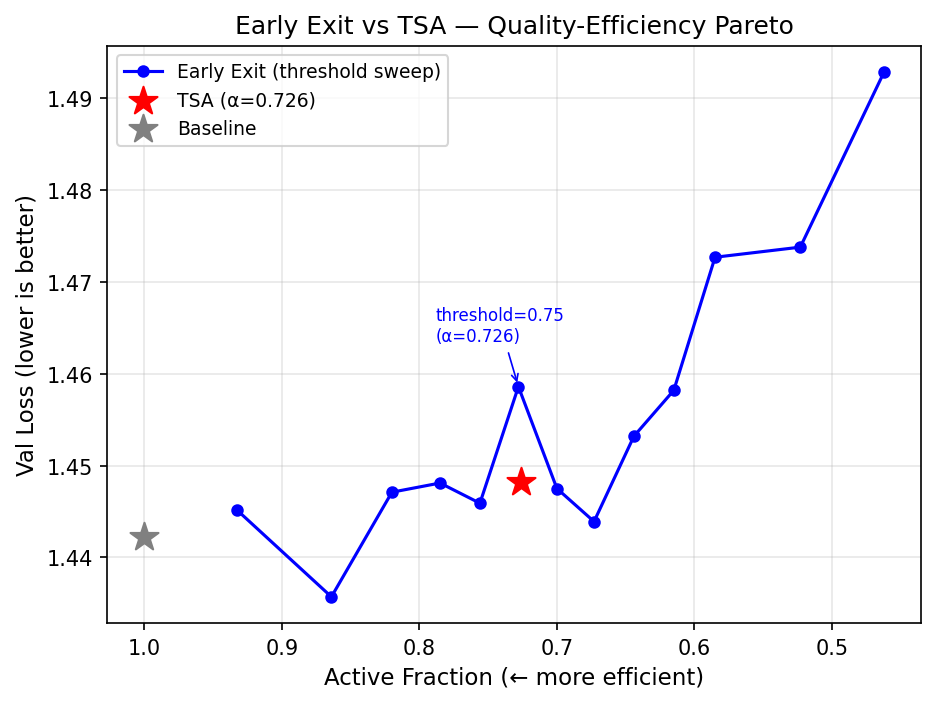

# Ablation Study — Early Exit vs TSA

**Date:** 2026-04-02
**Hardware:** Apple MacBook Pro (M1 Pro, 16 GB unified memory)
**Framework:** MLX (Metal GPU)
**Model:** d_model=256, n_layers=6, n_heads=8, d_ff=1024, vocab=65 (Shakespeare)
**Config:** 5,000 steps, batch=64, ctx=128, lr=0.0003
**Training time:** 1103s (18.4 min)

---

## Summary

Early Exit (EE) is the standard per-token inference-time baseline for early-stopping
models. It trains a multi-head transformer with N auxiliary exit classifiers (one per
layer), using the **same dense training cost as a standard baseline**. Compute savings
arise only at inference via a per-token confidence threshold.

This ablation answers: **"why not just use early exit instead of TSA?"**

---

## Training Result (full model, no early exit)

| Metric | EarlyExit | Baseline (P6) |
|---|---|---|
| Val Loss | 1.4450 | 1.4422 |
| BPC | 2.0847 | 2.0807 |
| Active Frac (train) | 1.000 | 1.000 |
| Params | 4,784,896 | 4,784,896 |

*Note: EarlyExit has N extra exit LayerNorms but reuses tied embeddings — near-identical
parameter count to Baseline.*

---

## Threshold Sweep (inference active fraction)

| Threshold | Val Loss | BPC | Active Frac | Ops Saved |
|---|---|---|---|---|
| 0.99 | 1.4452 | 2.0849 | 0.933 | 5.6% |
| 0.95 | 1.4357 | 2.0713 | 0.864 | 11.3% |
| 0.90 | 1.4471 | 2.0877 | 0.820 | 15.0% |
| 0.85 | 1.4481 | 2.0891 | 0.785 | 17.9% |
| 0.80 | 1.4459 | 2.0861 | 0.756 | 20.3% | ← matched
| 0.75 | 1.4586 | 2.1043 | 0.728 | 22.7% | ← matched
| 0.70 | 1.4475 | 2.0883 | 0.700 | 25.0% | ← matched
| 0.65 | 1.4439 | 2.0831 | 0.673 | 27.3% |
| 0.60 | 1.4532 | 2.0965 | 0.644 | 29.7% |
| 0.55 | 1.4582 | 2.1037 | 0.615 | 32.0% |
| 0.50 | 1.4727 | 2.1247 | 0.585 | 34.6% |
| 0.40 | 1.4738 | 2.1263 | 0.523 | 39.8% |
| 0.30 | 1.4929 | 2.1538 | 0.462 | 44.9% |

---

## Quality Comparison at Matched Active Fraction (α ≈ 0.726)

| Condition | Val Loss | BPC | Active Frac | Ops Saved | Δ vs Baseline |
|---|---|---|---|---|---|
| Baseline | 1.4422 | 2.0807 | 1.000 | 0.0% | 0.0% |
| TSA (Phase 6) | 1.4482 | 2.0893 | 0.726 | 22.8% | +0.42% |
| EarlyExit (threshold=0.75) | 1.4586 | 2.1043 | 0.728 | 22.7% | +1.14% |

TSA quality advantage over EarlyExit at matched α: **+0.72%** val loss
(negative = TSA better, positive = EarlyExit better).

---

## Structural Analysis

### 1. Training compute

| Method | Train compute (vs Baseline) |
|---|---|
| Baseline | 1.00× |
| **EarlyExit** | **1.00× — identical (all layers always run)** |
| **TSA** | **0.73× — 27% ops saved at train AND inference** |

Early Exit saves compute only at inference. TSA's soft gating acts during training too:
`h += (1 - halt_prob) × δ` means the gradient signal is weighted by the gate, which
acts as implicit regularisation and improves sample efficiency.

### 2. Routing mechanism

- **EarlyExit:** exits when `max_softmax(logits) > threshold`. This is a *post-hoc*
  confidence measure that ignores the token's representational needs. A syntactically
  complex token with certain next-word prediction (e.g., deterministic punctuation)
  will exit early regardless of whether deeper processing would improve other positions'
  predictions.

- **TSA:** the router is a learned 2-layer MLP that sees the full hidden state h.
  It can route based on contextual complexity, not just output confidence. The gate
  `halt_prob ∈ [0,1]` is differentiable and trained jointly with the model weights.

### 3. Attention scope

Both methods run dense attention over all token positions (all-token KV). Neither can
reduce attention FLOPs — only FFN and residual update costs differ. EarlyExit skips
subsequent FFN+attn *computation for that token's layer*, but still holds positions
in the residual stream for downstream KV correctness.

### 4. Training stability

EarlyExit training is equivalent to Baseline + auxiliary CE heads — straightforward
gradient flow. TSA introduces a learned gate that affects the gradient path but
remains stable across λ ∈ [0, 0.1] (confirmed in λ sweep ablation).

---

## Figure

Pareto curve: active_frac (x, inverted left=efficient) vs val_loss (y).
EarlyExit threshold sweep (blue), TSA Phase 6 (red star), Baseline (grey star).

---

## Decisions Logged

- D049: Early exit ablation methodology — see docs/plans/decision_log.md
