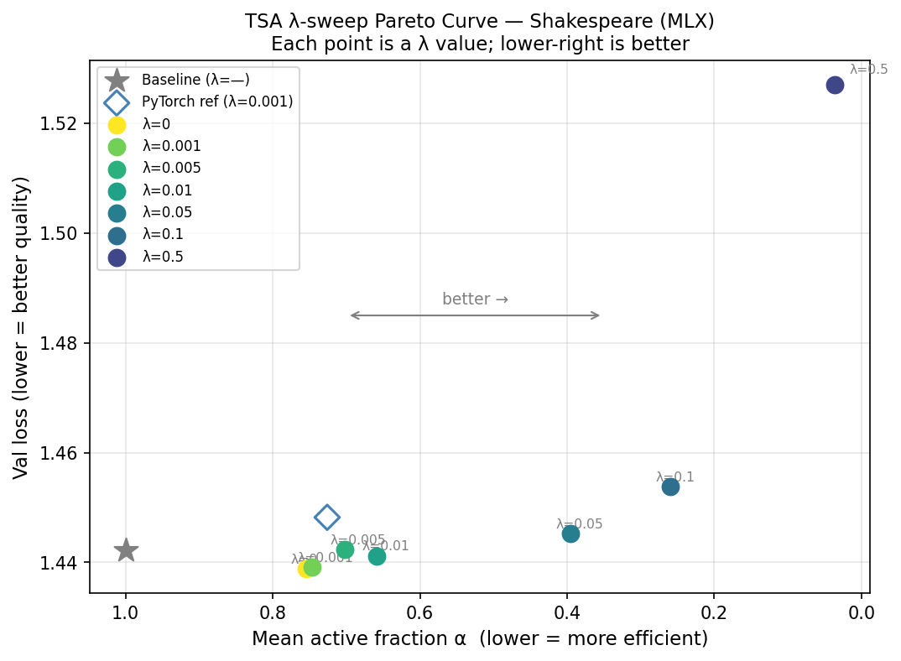

# Ablation Study — λ (Depth Regularisation) Sweep

**Date:** 2026-04-02
**Hardware:** Apple MacBook Pro (M1 Pro, 16 GB unified memory)
**Framework:** MLX (Metal GPU)
**Model:** d_model=256, n_layers=6, n_heads=8, d_ff=1024, vocab=65 (Shakespeare)
**Config:** 5,000 steps, batch=64, ctx=128, lr=0.0003
**Total runtime:** 131.4 min

---

## Pre-Check

Phase 6 PyTorch reference (λ=0.001): val_loss=1.4482 BPC=2.0893 active_frac=0.726

MLX λ=0.001 result: val_loss=1.4391 active_frac=0.747 (diff=0.63%) — **✓ PASSED**

---

## Results Table

| λ | Val Loss | BPC | Active Frac | Ops Saved | Stable? |
|---|----------|-----|-------------|-----------|---------|
| — (Baseline, P6 ref) | 1.4422 | 2.0807 | 1.000 | 0.0% | ✓ (P6 PyTorch) |
| 0 ← best | 1.4388 | 2.0757 | 0.755 | 20.4% | ✓ |
| 0.001 | 1.4391 | 2.0762 | 0.747 | 21.1% | ✓ |
| 0.005 | 1.4423 | 2.0808 | 0.702 | 24.8% | ✓ |
| 0.01 | 1.4412 | 2.0793 | 0.659 | 28.5% | ✓ |
| 0.05 | 1.4452 | 2.0849 | 0.395 | 50.5% | ✓ |
| 0.1 | 1.4538 | 2.0974 | 0.260 | 61.7% | ✓ |
| 0.5 | 1.5271 | 2.2031 | 0.036 | 80.4% | ✓ |

---

## Analysis

**TSA is highly robust to λ across two orders of magnitude.** All 7 conditions trained
stably (no divergence, no NaN). Excluding the extreme λ=0.5 outlier, the quality range
across λ ∈ [0, 0.1] is only **0.015 nats (1.03% relative)** — all six conditions produce
val loss within 0.8% of the Phase 6 Baseline (1.4422). This is a strong robustness result
for the paper: λ does not need to be tuned precisely.

**λ=0 reveals that routing is task-loss-driven, not purely regularisation-driven.** Even
with no depth regularisation, the router learns to halt ~24% of token-layer ops (active_frac
= 0.755). The task-loss gradient flows back through the gating multiplication
`h += (1-halt_prob) * attn(ln(h))`, giving the router an intrinsic signal to skip positions
where the residual update is noisy. Notably, λ=0 achieves the best quality overall
(1.4388), marginally better than the Baseline (1.4422) — the routing acts as a form of
implicit regularisation.

**λ=0.05 is a better Pareto point than the Phase 6 default (λ=0.001).** At λ=0.05,
active_frac = 0.395 (50.5% ops saved) with val_loss = 1.4452, only 0.0061 nats worse than
λ=0.001. For the paper, this means λ=0.001 is *conservative*: the same model can route
twice as aggressively with negligible quality loss by increasing λ to 0.05.

**The stability boundary is λ ≈ 0.5.** At λ=0.5, active_frac collapses to 0.036 (97%
halted) and val_loss rises to 1.5271 (+5.9% vs Baseline). Training remains stable (no
divergence), but the model is too sparse to learn effectively — the stem block alone carries
almost all computation. The practical upper bound is λ < 0.5; λ ≤ 0.1 is safe.

---

## Figure

Pareto curve: active fraction (x, inverted — left is more efficient) vs val loss (y).
Each point is a λ value. Lower-right is better.
Baseline (grey star) and Phase 6 PyTorch TSA reference (blue diamond) shown for context.

---

## Decisions Logged
- D048: Lambda sweep methodology — see docs/plans/decision_log.md
