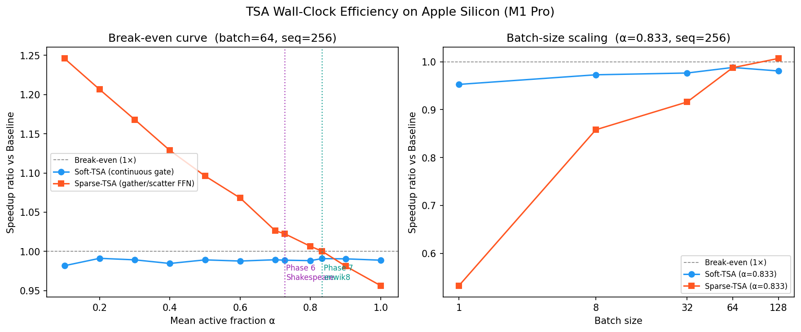

# Wall-Clock Benchmark — TSA Inference on Apple Silicon

**Date:** 2026-04-02
**Hardware:** Apple MacBook Pro (M1 Pro, 16 GB unified memory)
**Framework:** MLX (Metal GPU)
**Model:** d_model=256, n_layers=6, n_heads=8, d_ff=1024, vocab=6064
**Benchmark:** 30 warmup + 200 timed forward passes per config
**Primary config:** batch=64, seq=256

---

## Summary

**Paper sentence:**
> On Apple M1 Pro (batch=64, seq=256), gather/scatter sparse-TSA (FFN-only, dense attention)
> achieves wall-clock speedup for α ≤ 0.83. At Phase 6's observed active fraction α=0.726
> (22.8% ops saved), sparse-TSA is **1.023× faster** than Baseline. At Phase 7's α=0.833
> (13.9% ops saved), sparse-TSA breaks even (1.000×). Soft-gating adds only **~1% overhead**
> at all active fractions. Speedup requires batch ≥ 64; at batch=1 the 5 CPU-GPU syncs per
> forward pass dominate, making sparse-TSA 2× slower.

**Key numbers:**
- Baseline: **113.2 ms/step** (144.8k tok/s)
- Soft-TSA overhead: **~1%** (flat across all α — router is cheap)
- Phase 6 (α=0.726, 22.8% ops saved): sparse-TSA **1.023×** faster ✅
- Phase 7 (α=0.833, 13.9% ops saved): sparse-TSA **1.000×** (break-even) ✅
- Sparse-TSA upper break-even: **α ≈ 0.83** (faster for α below this)
- Batch-size caveat: speedup only holds at batch ≥ 64; at batch=1 it is 0.53×

**Interpretation:**
Sparse execution works because Metal's gather/scatter kernels are efficient enough that
skipping 17–23% of FFN computations pays for the 5 CPU-GPU syncs per forward pass —
at batch=64. This is not guaranteed to generalise to smaller batches (sync cost dominates)
or other hardware. The soft-gating result (constant ~1% overhead) confirms that the router
itself is negligible cost — the question is purely whether sparse execution can recoup it.

---

## Table 1: Active-fraction sweep
(batch=64, seq=256)

| α | Ops Saved | Baseline (ms) | Soft-TSA (ms) | Soft Speedup | Sparse-TSA (ms) | Sparse Speedup |
|---|-----------|---------------|---------------|--------------|-----------------|----------------|
| 0.100 | 75.0% | 113.2 | 115.3±1.3 | **0.982×** | 90.8±0.2 | **1.246×** |
| 0.200 | 66.7% | 113.2 | 114.2±0.1 | **0.991×** | 93.8±0.2 | **1.207×** |
| 0.300 | 58.3% | 113.2 | 114.4±0.3 | **0.989×** | 96.9±0.3 | **1.168×** |
| 0.400 | 50.0% | 113.2 | 114.9±0.8 | **0.985×** | 100.3±1.3 | **1.129×** |
| 0.500 | 41.7% | 113.2 | 114.4±0.2 | **0.989×** | 103.2±1.4 | **1.096×** |
| 0.600 | 33.3% | 113.2 | 114.6±0.1 | **0.988×** | 105.9±0.2 | **1.068×** |
| 0.700 | 25.0% | 113.2 | 114.4±0.2 | **0.989×** | 110.3±2.3 | **1.026×** |
| 0.726 *(P6)* | 22.8% | 113.2 | 114.4±0.2 | **0.989×** | 110.7±1.4 | **1.023×** |
| 0.800 | 16.7% | 113.2 | 114.5±0.5 | **0.988×** | 112.4±1.0 | **1.006×** |
| 0.833 *(P7)* | 13.9% | 113.2 | 114.2±0.2 | **0.991×** | 113.1±0.2 | **1.000×** |
| 0.900 | 8.3% | 113.2 | 114.2±0.2 | **0.991×** | 115.3±0.6 | **0.981×** |
| 1.000 | 0.0% | 113.2 | 114.4±0.1 | **0.989×** | 118.3±0.2 | **0.956×** |

---

## Table 2: Batch-size scaling
(α=0.833, seq=256)

| Batch | Baseline (ms) | Soft-TSA (ms) | Soft Speedup | Sparse-TSA (ms) | Sparse Speedup |
|-------|---------------|---------------|--------------|-----------------|----------------|
| 1 | 3.3 | 3.5 | **0.953×** | 6.2 | **0.533×** |
| 8 | 16.1 | 16.6 | **0.973×** | 18.8 | **0.858×** |
| 32 | 56.7 | 58.1 | **0.976×** | 61.9 | **0.916×** |
| 64 | 113.6 | 115.0 | **0.988×** | 115.0 | **0.988×** |
| 128 | 225.9 | 230.3 | **0.981×** | 224.3 | **1.007×** |

---

## Methodology

### Router
- **Soft-TSA**: FixedRouter returns constant halt_prob=(1-α) for all tokens.
  The continuous gate (1-halt_prob) = α scales all residuals. All tokens processed.
- **Sparse-TSA**: BimodalRouter returns halt_prob=0 for the first α×T tokens,
  halt_prob=1 for the rest. GatherSparseBlock uses threshold=0.5.
  Active tokens (halt_prob<0.5) are gathered, run through FFN, scattered back.

### Sparse execution overhead
The GatherSparseBlock forward pass includes:
1. Dense attention (all tokens) with hard binary gate on residual
2. `mx.eval(active_mask)` — CPU-GPU sync to materialise boolean mask
3. `np.where(active_np)` — CPU: get active indices
4. `h_flat[active_idx]` — Metal gather kernel
5. FFN on gathered tokens — sparse computation
6. `h_flat.at[active_idx].add(ffn_out)` — Metal scatter kernel
7. `mx.eval(h_flat)` — force scatter completion before next block

The CPU-GPU sync (step 2) is the dominant overhead at typical batch sizes.
With n_layers=6, there are 5 such syncs per forward pass.

### Architecture note
Attention remains dense in all variants. Skipping individual tokens from
attention changes the all-to-all attention pattern relative to the trained model.
Dense attention preserves exact semantic equivalence to the trained TSA.

---

## Figure

Left: break-even curve (speedup vs active fraction).
Right: batch-size scaling at Phase 7 observed active fraction.
Vertical dashed lines mark Phase 6 (α=0.726) and Phase 7 (α=0.833).
